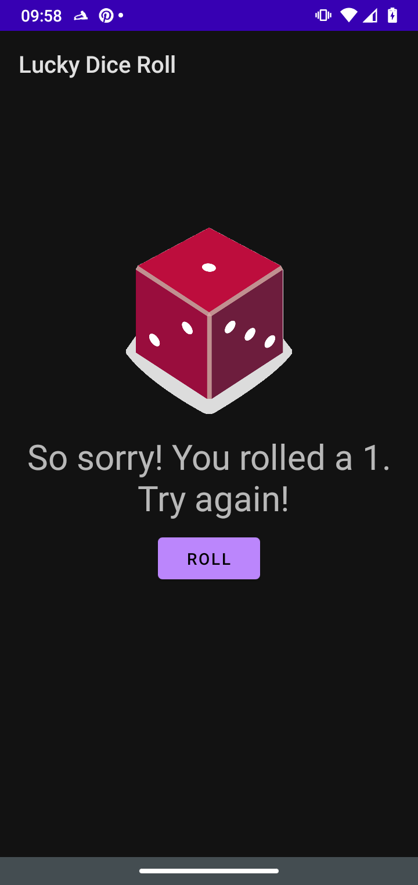

# Dice Roller

Dice Roller app from Android Basics in Kotlin at developers.google.com.

It is a simple demo using ConstraintLayout, TextView, Button and imageView.

## The extra mile

- A history with the last three rolls

## About the branchs

- Main
  - A single dice roll.
- Two Dices
  - A variation with two dices
- Lucky Dice Roll.
  - A variation that tries to get a roll equals to the luck number.
